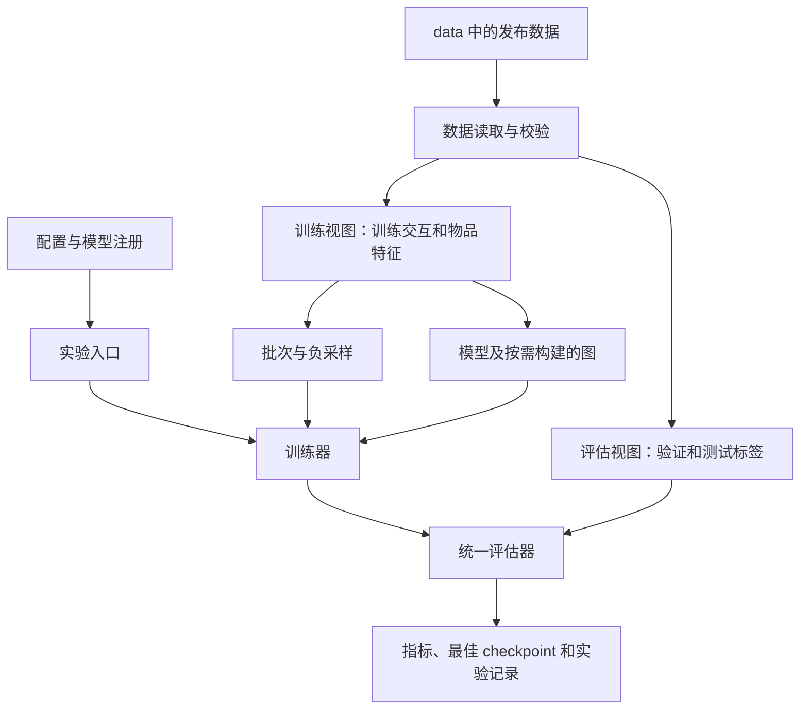

# 多模态推荐复现框架设计

状态：架构契约。MGCN、公共数据/采样、训练、评估、图缓存和 epoch 边界恢复已实现；BM3、SMORE、BPR、LightGCN 仍为扩展计划。当前可运行命令及公式对应见 [MGCN 实现说明](mgcn.md)。

目标是在同一数据和评估协议下独立实现 BM3、MGCN、SMORE，并方便扩展 BPR、LightGCN、其他多模态方法及消融实验。直接读取 `data/` 中 MMRec 已处理的数据，不重新引入原始数据预处理模块。MMRec 作为参考，不作为新代码的运行依赖。

## 1. 核心分工

统一数据读取、训练调度和评估协议；模型自己定义网络、损失及需要的图。添加常规方法时，主要新增一个模型文件、一份配置和一条注册信息，不在训练器中添加 `if model == ...` 分支。



训练视图可以使用全局用户/物品数量和所有物品的发布特征，但不能访问验证/测试的交互标签。这是传导式推荐设置，不是严格的归纳式冷启动设置。

## 2. 建议目录

```text
COMP5331/
├── data/                         # 已发布数据及使用说明
├── configs/
│   ├── default.yaml              # 公共训练与评估默认值
│   ├── datasets/                 # 文件路径、字段名、模态文件
│   │   ├── baby.yaml
│   │   └── ...
│   ├── models/                   # 方法参数与优化参数
│   │   ├── bm3.yaml
│   │   ├── mgcn.yaml
│   │   └── smore.yaml
│   └── experiments/              # 某模型×某数据集的完整实验覆盖项
├── src/mmrecsys/
│   ├── cli.py                    # train / evaluate 入口
│   ├── config.py                 # 配置合并、校验、保存最终配置
│   ├── registry.py               # 显式模型注册及能力声明
│   ├── data/
│   │   ├── dataset.py            # MMRec 文件读取、全局编号和校验
│   │   ├── views.py              # TrainData、EvalData
│   │   └── sampling.py           # 正交互批次、训练负采样
│   ├── models/
│   │   ├── base.py               # 模型契约及返回值类型
│   │   ├── bpr.py
│   │   ├── lightgcn.py
│   │   ├── bm3.py
│   │   ├── mgcn.py
│   │   └── smore.py
│   ├── nn/
│   │   ├── graph.py              # 稀疏图构建、归一化、kNN
│   │   ├── layers.py             # 已确认为多方法共用的运算层
│   │   └── losses.py             # BPR、正则化等通用运算
│   ├── engine/
│   │   ├── trainer.py            # 单优化器训练、验证、早停
│   │   ├── evaluator.py          # 候选屏蔽、分块排序、指标汇总
│   │   ├── metrics.py            # Recall、NDCG 等纯计算函数
│   │   └── checkpoint.py         # 保存/恢复训练状态
│   └── experiment/
│       ├── runner.py            # 组装数据、模型和训练器
│       ├── seed.py              # 随机源及 DataLoader worker 种子
│       ├── artifacts.py         # 特征/图缓存和内容指纹
│       └── logging.py           # 配置、指标和环境记录
├── tests/                        # 公共协议和各方法的关键行为
├── docs/architecture.md
├── runs/                         # 每次实验的输出，不提交 Git
├── cache/                        # 可重建缓存，不提交 Git
└── MMRec/                        # 只供参考
```

这是目标布局，不必一次性创建所有空文件。先在清晰的模块内完成实现，只有出现真实复用时才把算子提取到 `nn/`。SMORE 特有的频域融合首先保留在 `models/smore.py`，避免过早抽象。

## 3. 数据与批次契约

| 类型 | 内容 | 可以访问它的组件 |
| --- | --- | --- |
| `TrainData` | `n_users`、`n_items`、训练边 `[N, 2]`、训练历史 CSR、模态特征字典、数据指纹 | 模型、采样器、构图工具 |
| `EvalData` | split 名称、待评估用户、目标物品 CSR、需屏蔽的历史 CSR | 评估器 |
| `TrainBatch` | `users: LongTensor[B]`、`positive_items: LongTensor[B]`、可选 `negative_items: LongTensor[B, K]` | 模型损失接口 |

`features` 使用 `{"image": ..., "text": ...}` 字典，不把两个模态硬编码到所有公共类中，便于以后增加音频或使用单模态方法。模型注册信息声明所需模态；纯协同模型不必把模态特征载入 GPU。

读取层检查字段、标签、ID 范围、特征行数、非有限值及跨集合重复交互。异常时报告，不自动修改发布数据。交互与原始特征默认保留在 CPU；图和模型实际需要的 Tensor 再移动到设备，不将整个数据对象自动搬到 GPU。

训练采样只读取训练历史。负样本排除用户的训练正例，不利用验证/测试标签；遇到用户已交互全部物品时应显式报错，避免无限重采样。相同种子、epoch 和 worker 设置下采样可复现。

## 4. 模型最小接口

以下接口已在 `src/mmrecsys/models/base.py` 实现（此处省略具体实现）：

```python
@dataclass
class LossOutput:
    total: Tensor                    # 标量，保留反向传播图
    components: dict[str, Tensor]    # 命名损失项，只用于记录
    batch_size: int                 # 用于按样本数加权统计

class Scorer(Protocol):
    def score(self, users: Tensor, items: Tensor) -> Tensor:
        # users: [B]，items: [C]，输出所有组合的分数 [B, C]
        ...

class Recommender(nn.Module):
    def compute_loss(self, batch: TrainBatch) -> LossOutput:
        ...

    def make_scorer(self) -> Scorer:
        # 在 eval + no_grad 下创建，仅在本次评估内有效
        ...

    def on_epoch_start(self, epoch: int) -> None:
        pass

    def on_epoch_end(self, epoch: int) -> None:
        pass
```

模型工厂接收 `model_config`、`TrainData` 和图缓存服务，返回模型。构造函数不接收验证/测试集合，也不接收包含所有实验状态的“万能配置对象”。训练器仅负责对 `LossOutput.total` 反向传播，不重新拼装各模型的损失；记录 `components` 前 detach，避免累计计算图。

采用 `make_scorer()` 是为了让图模型每次评估只计算一次全图表示，然后分块打分；不强制所有方法都必须以“用户向量乘物品向量”的方式预测。BM3 可在 scorer 内应用自身 predictor，其他方法可返回自己的打分逻辑。scorer 不跨训练更新或 checkpoint 加载复用，避免使用过期表示。

模型内可训练参数使用 `nn.Parameter` 或子模块，固定图和固定 Tensor 使用 buffer，设备由外部显式指定。大型、可从指纹重建的图可使用不持久化 buffer，恢复 checkpoint 时重新加载匹配缓存；不要在模型内部写死 `.cuda()`。

## 5. 方法差异如何表达

注册表采用显式映射，每条记录包含模型工厂、所需模态、`BatchSpec` 和模型专属配置解析器。`BatchSpec` 描述采样类型（positive/pairwise）及负样本数，由 runner 组装相应采样器。

| 方法 | 训练批次 | 模型侧构建的结构 | 模型专属实现 |
| --- | --- | --- | --- |
| BPR | pairwise | 无需图 | ID embedding、BPR 损失 |
| LightGCN | pairwise | 训练用户—物品归一化图 | 图传播与排序损失 |
| BM3 | positive | 训练用户—物品归一化图 | predictor、dropout 目标、停止梯度和多项自监督损失 |
| MGCN | pairwise | 训练交互图、各模态物品 kNN 图 | 模态相关表示、多视图融合及损失 |
| SMORE | pairwise | 训练交互图、模态 kNN 图及融合图 | 频域融合、门控及损失 |

公共构图函数只接受明确输入和参数：是否包含自环、邻居数、边权、对称化和归一化方式必须可见，不能悄悄改变目标方法。相同操作可复用；有不同公式时保留独立实现。

构建物品 kNN 图时采用分块相似度计算与 top-k，不持有完整 `n_items × n_items` 相似度矩阵。缓存键至少包含特征内容摘要、节点编号、k、相似度、归一化、自环/对称化规则、算法版本；训练交互图另外包含训练划分摘要。缓存存储 CPU 稀疏数据，写入完成后原子发布。

初版覆盖三个目标方法所需的单优化器训练。将来若方法需要交替优化、多优化器或多阶段训练，再新增显式训练策略；不要让模型在 `compute_loss()` 内自行调用 `backward()`/`step()`，也不要靠越来越多的模型名条件分支扩展训练器。

## 6. 训练与评估生命周期

一次实验按以下顺序执行：

1. 合并和校验配置，固定种子，创建独立的 run 目录，保存最终配置。
2. 读取发布数据，生成训练/评估视图，依据模型注册信息创建批次迭代器和模型。
3. 对每个 epoch 调用 `model.train()` 和开始 hook；对批次执行清梯度、计算损失、反向传播、优化器更新，最后调用结束 hook。
4. 达到验证间隔时切换 `model.eval()`，在无梯度环境中创建 scorer，统一计算验证指标，更新最佳 checkpoint 和早停状态；下一训练 epoch 恢复训练模式。
5. 训练结束后加载验证集选出的最佳 checkpoint，重新创建 scorer，执行最终测试并保存结果。

若某方法训练阶段需要图增强或图重采样，放在显式 epoch hook 中；评估阶段的行为由 `eval()` 和 scorer 契约控制。不要缓存跨批次复用的带梯度全图表示，因为每次优化器更新都会使其过期。

评估器负责以下公共行为：

- 全物品排序，按用户和候选物品双重分块打分，将各块 top-k 合并为全局 top-k，控制显存占用。
- 在每块 top-k 前屏蔽历史物品，不能先取候选再屏蔽；不足 K 个可推荐物品时，不将填充位置计作推荐结果。
- 默认对齐本地 MMRec：验证和测试均屏蔽训练历史，不额外屏蔽验证历史；评估用户是否必须有训练历史也显式配置。规则写入实验结果。
- 对 Recall/NDCG 等指标先按用户计算，再对符合协议且有目标交互的用户求平均；记录实际评估用户数。测试标签只用于最终指标，不参与模型选择。
- 明确定义同分排序规则和 K 大于可推荐数量时的处理。用手算样例验证，不能只比较输出 Tensor 的形状。

## 7. 配置与实验记录

配置优先级为：`default.yaml < datasets/<name>.yaml < models/<name>.yaml < experiments/<name>.yaml < CLI 覆盖`。每层保持命名空间边界，并校验未知字段；禁止静默忽略拼写错误。路径统一相对于项目根目录解析并记录绝对路径，不依赖启动命令时的工作目录。

示意配置：

```yaml
seed: 2024
data:
  name: baby
  root: data
model:
  name: bm3
  embedding_dim: 64
  n_layers: 1
  dropout: 0.3
  reg_weight: 0.01
  cl_weight: 2.0
optimizer:
  name: adam
  lr: 0.001
train:
  epochs: 1000
  batch_size: 2048
  eval_every: 1
  patience: 20
eval:
  topk: [10, 20]
  monitor: Recall@20
  mode: max
  history: train
  require_train_user: true
  user_batch_size: 256
  item_chunk_size: 4096
runtime:
  device: cuda:0
  output_root: runs
  cache_root: cache
```

这些值用于说明配置结构，不代表已验证的最佳超参数。模型文件接收属于自己的配置，训练器和评估器分别接收自己的配置；不要把同一个键分别在多个位置定义为不同含义。

已提供 train / evaluate 命令；当前注册的模型为 mgcn：

```bash
python -m mmrecsys.cli train --model mgcn --dataset baby --seed 2024
python -m mmrecsys.cli train --config configs/experiments/mgcn_baby.yaml
python -m mmrecsys.cli evaluate --run runs/<run_id> --split test
```

每个 `runs/<run_id>/` 包含 `config.yaml`、`manifest.json`、逐 epoch 的 `metrics.jsonl`、`best.pt`、`last.pt` 和 `result.json`。manifest 记录数据/特征摘要、代码版本、依赖版本、设备和评估协议。

`best.pt` 用于按验证指标选出的模型；`last.pt` 用于恢复训练，除模型参数外还需包含优化器、调度器、epoch、global step、早停状态、Python/NumPy/Torch 的随机状态以及独立采样生成器状态。初版承诺在 epoch 边界恢复，worker 种子按 seed/epoch 派生，不承诺批次中途精确续训。恢复时检查配置和数据指纹是否兼容。

## 8. 实现顺序与扩展步骤

建议按可验证的小阶段落地：

1. 先实现数据视图、公共评估器和 BPR，打通训练—验证—最佳模型—测试闭环。
2. 实现稀疏构图工具与 LightGCN，验证编号偏移、归一化和图传播。
3. 加入 BM3，确认无负样本批次、目标分支停止梯度和模型特有打分。
4. 加入分块 kNN 与缓存，再实现 MGCN、SMORE，复用真正相同的构图操作。
5. 最后补充多种子汇总和独立的超参数搜索入口，搜索过程仅根据验证指标选参数。

新增常规方法时：编写 `models/new_method.py`，实现 `compute_loss()` 和 `make_scorer()`；声明采样类型和模态要求；新增配置并显式注册；补充一个小数据集上的梯度/打分验证，再运行共享评估协议测试。不复制数据加载器、训练循环和评估器。

优先测试具有实际错误风险的行为：划分与特征行号一致、验证/测试边不会进入训练图、负样本满足训练约束、稀疏图与手算结果一致、分块 top-k 与小规模完整排序一致、历史屏蔽与指标一致、checkpoint 恢复及随机状态一致。完整训练指标验证应在上述行为通过后进行。

## 9. 当前实现范围

当前已完成 MGCN 和所需公共框架，不创建尚未实现模型的占位文件。采样器使用单进程，随机种子按 seed/epoch 派生；没有 DataLoader worker 配置。第 1 轮验证，此后按 eval_every 验证，使短跑和延长训练使用一致的验证调度。缓存和 checkpoint 使用原子写入；模型固定图与固定特征可按指纹重建。精确 kNN 在 CPU 分块构建，训练和评估支持 CPU/CUDA。具体公式分歧、默认参数及已验证行为见 [MGCN 实现说明](mgcn.md)。
