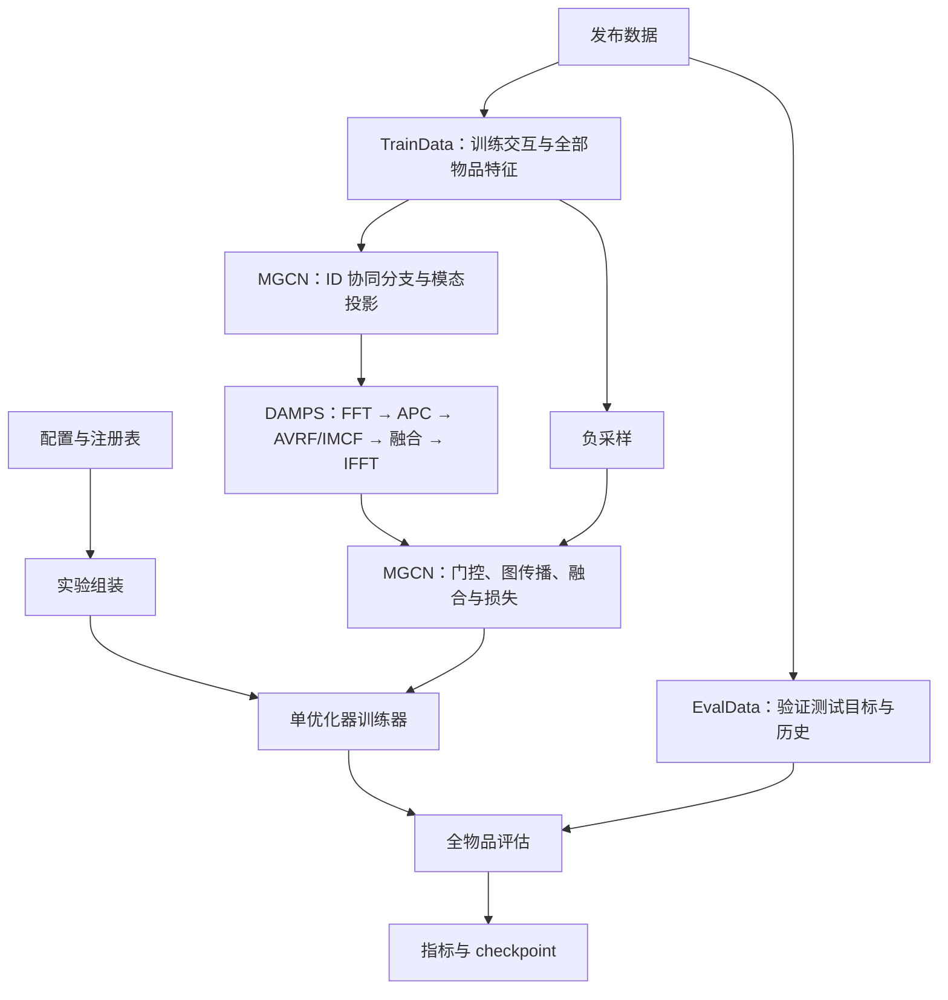

# DAMPS 复现项目架构

目标：按 [DAMPS.pdf](../DAMPS.pdf) 复现频域多模态表示校准，并在一致的数据和评估协议下比较 backbone 与 backbone + DAMPS。当前已接入 MGCN 与 [LIRDRec](lirdrec.md)，后者已完成含 MicroLens 的五数据集、五组对照/消融、三种子共 75 组正式实验；结果与实现局限见 [LIRDRec 实验结果](results/lirdrec/)。公式与歧义见 [DAMPS 实现说明](damps.md)，MGCN 原始约定见 [backbone 文档](mgcn.md)。以下数据流以 MGCN 为例。

## 分层与数据流

DAMPS 是模型内的 `nn.Module`，接收两个 `[n_items, embedding_dim]` 投影表示；复用 backbone 损失，不增加训练阶段或优化器。原始特征构造的 kNN 图与 ID 协同分支沿用 MGCN。训练器不根据模型或 DAMPS 开关分支。

## 目录与职责

| 位置 | 职责 |
| --- | --- |
| `src/mmrecsys/nn/damps.py` | 论文频谱校准、组件消融与可学习参数 |
| `src/mmrecsys/models/mgcn.py` | MGCNConfig、模态投影后的 DAMPS 接入及 backbone 计算 |
| `src/mmrecsys/models/lirdrec.py` | LIRDRecConfig、固定 DCT 分支、PWC 状态及投影后的 DAMPS 接入 |
| `src/mmrecsys/models/base.py` | Recommender、LossOutput、Scorer 接口 |
| `src/mmrecsys/registry.py` | backbone 工厂、配置解析、模态与 batch 需求 |
| `src/mmrecsys/data/` | 发布数据校验、训练评估视图隔离、训练负采样 |
| `src/mmrecsys/nn/graph.py` | 稀疏训练图、分块精确 kNN 与归一化 |
| `src/mmrecsys/engine/` | 训练、评估、排序指标与 checkpoint |
| `src/mmrecsys/experiment/search.py` | 配对验证提升搜索、候选跳过测试评估、恢复与最佳配置导出 |
| `src/mmrecsys/experiment/ablation.py` | 同 backbone 配置、多种子配对消融与汇总 |
| `src/mmrecsys/experiment/lirdrec_suite.py` | LIRDRec 五数据集五组实验、单卡队列、恢复及跨种子汇总 |
| `src/mmrecsys/experiment/` | 实验组装、设备、种子、缓存和产物 |
| `configs/experiments/damps_mgcn_*.yaml` | 四个 Amazon 数据集的 DAMPS + MGCN 配置 |
| `configs/experiments/mgcn_*.yaml` | MGCN 基线配置 |
| `configs/experiments/{damps_,}lirdrec_*.yaml` | 五数据集的 LIRDRec 基线与 DAMPS 配置 |
| `docs/results/lirdrec/` | 提交到版本控制的精选结果与论文对照 |
| `tests/test_damps.py` | 独立公式与模块集成测试 |
| `tests/test_experiment.py` | 基线和 DAMPS 的完整小数据训练、评估、恢复 |
| `MMRec/` | 参考代码，不作为运行依赖 |

## 模型与训练契约

模型工厂只接收模型配置、TrainData 和图缓存服务。`compute_loss(batch)` 返回标量 total、命名 components 和 batch_size；训练器执行 backward 和 step；每轮首批次 backward 后、step 前通过 training_diagnostics() 获取独立诊断字段，写入 metrics.jsonl。`make_scorer()` 在 eval/no_grad 下每次评估只编码一次，然后分块打分。scorer 不跨参数更新或 checkpoint 加载复用。

DAMPS 在模型构造时用全部物品的初始投影一次性估计 AVRF 权重初值和相位先验，不使用交互 mini-batch 估计。前向不重新估计这些统计量，也不缓存跨优化步骤的带梯度表示。AVRF 权重、ψ 与融合 logits 由 nn.Parameter 注册；固定相位先验及初始化标记作为持久 buffer，随模型迁移设备并进入 checkpoint。固定图用非持久 buffer，通过数据指纹恢复。模型不写死 CUDA 设备。

## 数据与评估契约

- TrainData 只包含全局规模、训练边、训练历史、物品特征和指纹；EvalData 保存验证/测试标签。全部发布物品特征用于 DAMPS 属于传导式设置，不读取验证或测试交互构图。
- 负采样只排除训练正例；沿用发布编号、划分和特征行顺序，拒绝格式错误、非有限特征及跨集合重复交互。
- 精确 kNN 分块计算，不保存完整 N×N 相似度矩阵。缓存键包含特征指纹、编号、k、边权、自环、对称化、归一化和算法版本；交互图包含训练划分指纹。
- 全物品排序，用户和候选物品双重分块；先屏蔽历史再取 top-k，同分按物品 ID 升序，填充候选不计入指标。
- 默认验证与测试都屏蔽训练历史，可显式配置测试额外屏蔽验证历史；指标为用户宏平均。验证 Recall@20 选模，加载最佳 checkpoint 后评估测试集。

## 配置、产物和恢复

配置优先级：default < dataset < model < experiment < CLI。未知字段报错，相对路径按项目根解析。`model.name` 选择 `mgcn` 或 `lirdrec` backbone，`model.damps_enabled` 控制校准；三个组件开关与 epsilon 均属于模型配置。添加其他 backbone 时复用 DAMPS 模块，在其对应投影之后接入，不复制训练器。

新运行目录以 backbone 名称命名，启用 DAMPS 时增加 `damps-` 前缀，例如 `runs/damps-lirdrec-<dataset>-<time>-<id>/`。目录保存最终 config、manifest、逐轮指标、best.pt、last.pt 和 result.json，具体组件配置以 config.yaml 为准。已有目录不重命名，断点恢复继续使用原目录。原始数据、缓存、运行目录与 checkpoint 不提交 Git，精选结果单独保存在 `docs/results/lirdrec/`。

checkpoint 保存模型、优化器、调度器、采样器、随机状态、epoch 和早停状态；恢复检查配置与数据指纹，仅允许延长训练轮数、变更产物位置等既有允许项，不允许中途切换 DAMPS 组件。承诺 epoch 边界恢复，不承诺跨设备逐位一致。新增 DAMPS 配置字段后，旧版本 checkpoint 的配置字典可能不兼容；没有自动迁移旧 checkpoint。

## 复现验证顺序

先核对论文公式及数值边界，再验证梯度、基线一致性、训练评估与恢复；然后进行同配置的 MGCN/DAMPS 完整训练和组件消融。工程测试通过不等于表格指标复现完成。相位方向已恢复为作者的 image−/text+，IMCF 仍采用作者的逐元素功率比，详见 [复现约定](damps.md)。
